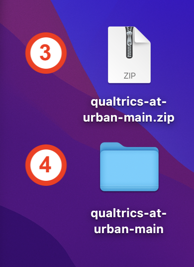

# Explore the Demo Dashboard

If you have an Urban Institute Qualtrics account, follow the instructions below to recreate the <a href="https://fvescia.shinyapps.io/qual-dash/" target="blank">demo dashboard</a> on your own computer. Once the dashboard is up and running, you can play around with the code to get a better sense for how it works. If you don't have an Urban Institute Qualtrics account, you can still read through the code in `app.R` to see how a Shiny app works, you just won't be able to recreate the dashboard locally. If you're new to Shiny or want a refresher, see <a href="https://shiny.posit.co/r/getstarted/shiny-basics/lesson1/index.html" target="blank">Shiny Basics</a>.

1. Start by saving the demo dashboard files to your computer. An easy way to do this is to download the `qualtrics-at-urban` repository and then extract the `demo` folder. To do this, go to https://github.com/UI-Research/qualtrics-at-urban/, click the green "<> Code" button (1), and select "Download Zip" (2). Once you have downloaded the zip file to your computer (3), double-click it to unzip the `qualtrics-at-urban` folder (4). Click into the the `qualtrics-at-urban` folder and then into the `qual-dash` folder (5), then drag and drop the `demo` folder (6) to your desired location on your computer. Once you have extracted the `demo` folder, delete `qualtrics-at-urban`.

    

     

2. This demo comes with a virtual environment. We encourage you to use it, so you don't have to worry about installing the necessary packages on your system. To activate the virtual environment, open RStudio, go into your local copy of the `demo` repo, and run `renv::restore()` in the RStudio console. If you're new to working with virtual environments, this is a <a href=“URL” target="blank">great introduction</a>. If you opt not to use the virtual environment, you'll need to install the packages loaded at the top of `app.R` locally.

3. Follow these instructions to get your Qualtrics API key and configure R for key-based authentication with the Qualtrics API. All Qualtrics users with Urban Institute accounts have access to the example survey used in the demo, so you will be able to download the demo data as soon as you have R configured to use the Qualtrics API.

4. Request a <a href="https://api.census.gov/data/key_signup.html" target="blank">Census API key</a>. (The demo uses ACS data as well as Qualtrics data.) Replace the text in brackets with you Census API key, then run this code in your console to configure R for key-based authentication with the Census API: 

    `census_api_key("<YOUR_CENSUS_API_KEY>", install = TRUE)`

5. Launch the dashboard by clicking "Run App" in the upper-right corner of your RStudio <a href="https://teacherscollege.screenstepslive.com/a/1426910-panes-in-rstudio" target="blank">source editor</a> or running `runApp()` in your console. 

6. If you like, you can make changes to the code in `app.R` and then relaunch the app (repeat Step 5) to see how your changes affect the dashboard. The the <a href="https://shiny.posit.co/r/getstarted/shiny-basics/lesson1/index.html" target="blank">Shiny Basics</a> can help you understand what the code is doing. Pay special attention to the section on <a href="https://shiny.posit.co/r/getstarted/shiny-basics/lesson4/" target="blank">reactivity</a> if you want to understand exactly how the Refresh Qualtrics Data button works.

7. Now it's your turn - use the template and instructions in the `diy` folder to build your own survey data dashboard. Don't hestiate to reach out in the <a href="https://theurbaninstitute.slack.com/archives/CNUG9ELE5 
" target="blank">#qualtrics</a> or <a href="https://theurbaninstitute.slack.com/archives/CF56VD6CX" target="blank">#r-users-group</a> Slack channels with any questions!

**Acknowledgement:** `www/shiny.css` is lightly adapted from <a href="https://github.com/UrbanInstitute/urbntemplates/tree/main" target="blank">`urbnthemes`</a>.
